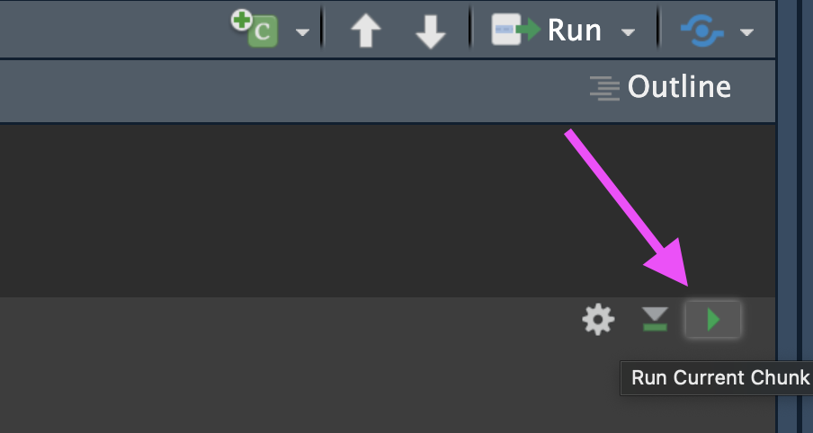
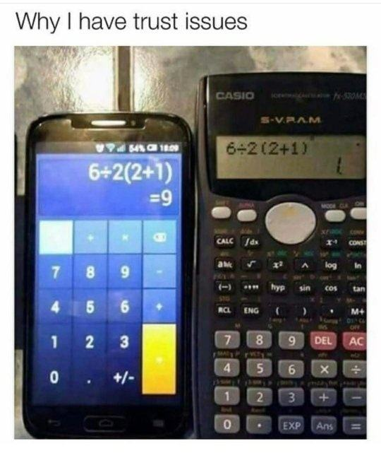
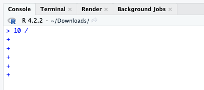
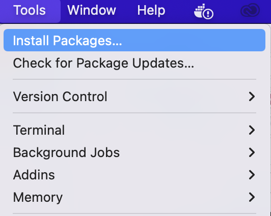
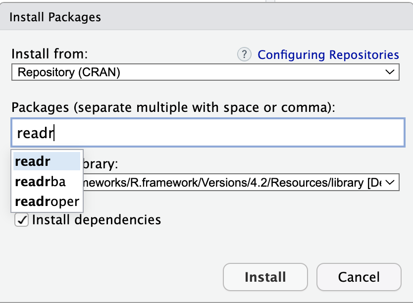
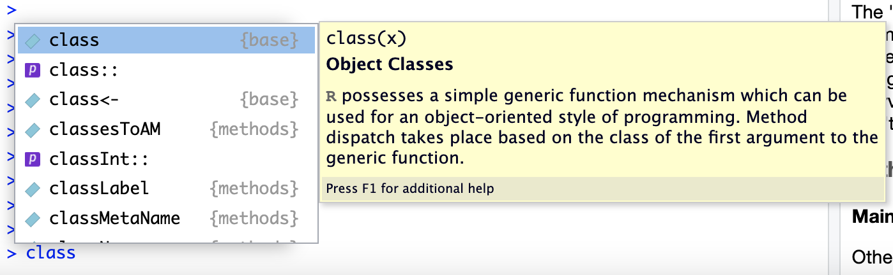
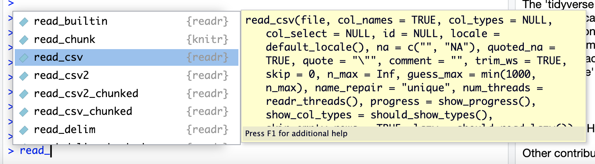
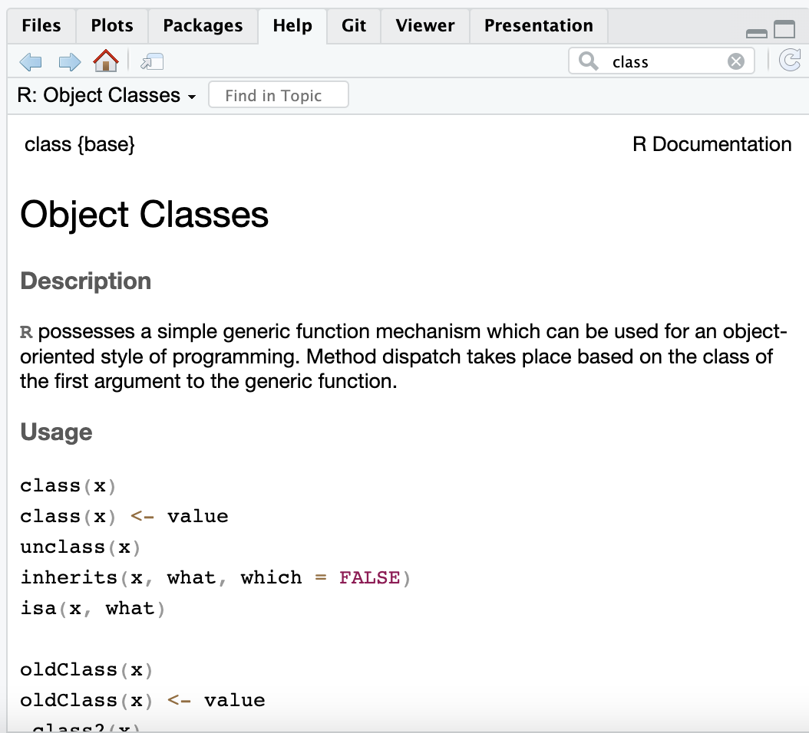
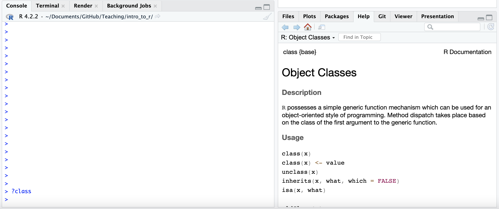
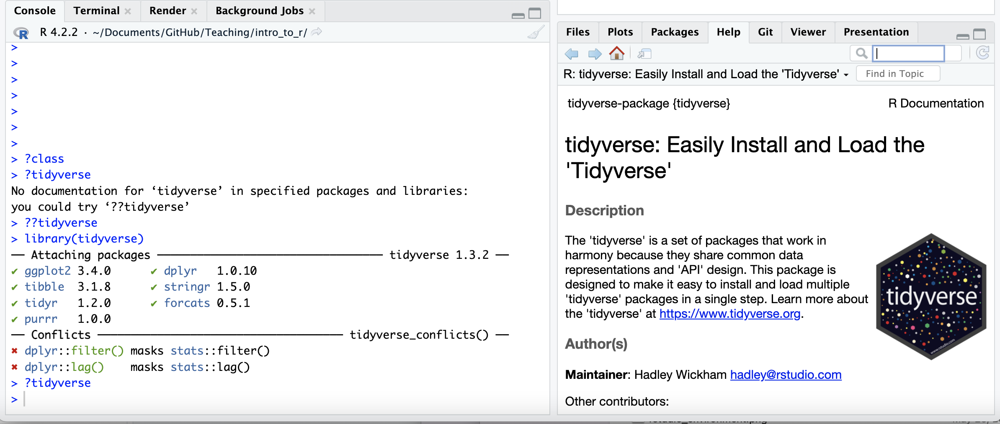

```{r, echo = FALSE}
library(knitr)
opts_chunk$set(comment = "")
```

## Running code chunks

Send code to run in the console:

- Run the whole chunk with the green play button (top right of the chunk)
- Run single line with ⌘+return or ctrl+return

```{r, fig.alt="The green RStudio play button is highlighted with an arrow. Press this button to run all the code inside the chunk.", out.width = "60%", echo = FALSE, out.extra='style="float:left"'}

```

## R as a calculator

```{r calcDemo}
2 + 2
2 * 4
2^3
```

Note: when you enter your command in the Console, R inherently thinks you want to print the result. 

## R as a calculator

- The R console is a full calculator
- Try to play around with it:
    - +, -, /, * are add, subtract, divide and multiply
    - ^ or ** is power
    - parentheses -- ( and ) -- work with order of operations 
    - %% finds the remainder

## R as a calculator

```{r calcDemo2}
2 + (2 * 3)^2
(1 + 3) / 2 + 45
6 / 2 * (1 + 2)
```

```{r, fig.alt="Problem gives answer of 1 or 9 depending on calculator.", out.width = "30%", echo = FALSE, out.extra='style="float:left"'}

```

```{r, fig.alt="Problem gives answer of 1 or 9 depending on calculator.", out.width = "60%", echo = FALSE, out.extra='style="float:left"'}
knitr::include_graphics("images/Basic_R_viral_math_problem.png")
```

## R as a calculator

Try evaluating the following:

- `2 + 2 * 3 / 4 -3`
- `2 * 3 / 4 * 2`
- `2^4 - 1`

## Commenting in Scripts

`#` creates a comment in R code

```{r}
# this is a comment

# nothing to its right is evaluated

# this # is still a comment
### you can use many #'s as you want

1 + 2 # Can be the right of code
```

In an `.Rmd` file, you can write notes outside the R chunks.

## RECALL: Objects

_object_: an object is something that can be worked with or on in R - can be lots of different things! You can think of objects as **nouns** in R.

## Assigning values to objects

- You can create objects from within the R environment and from files on your computer
- R uses `<-` to assign values to an object name (you might also see `=` used, but this is not best practice)

```{r}
x <- 2
x
x * 4
x + 2
```

## Assigning values to objects

- The most comfortable and familiar class/data type for many of you will be `data.frame`
- You can think of these as essentially spreadsheets with rows (usually subjects or observations) and columns (usually variables)
- `data.frame`s are somewhat advanced objects in R; we will start with simpler objects

But what can we do with objects... ?

## TERM: Function

```{r, out.width = "10%", echo = FALSE}

```

_function_: a piece of code that allows you to do something in R. You can write your own, use functions that come directly from installing R, or use functions from code developers.

You can think of a function as **verb** in R.

A function might help you add numbers together, create a plot, or organize your data.

## Assigning values to objects

- Here we introduce "1 dimensional" classes; often referred to as 'vectors'
- Vectors can have multiple sets of observations, but each observation has to be the same class.
- Use the `class()` function to check the class of an object.

```{r assignClass}
class(x)
y <- "hello world!"
class(y)
```

## numeric vs. character classes?

We will talk in-depth about classes. For now:

**numeric**

-  Numbers
-  No quotation marks

```{r eval = FALSE}
2
```

**character**

-  Text with quotation marks
-  Green lettering (default)

```{r eval = FALSE}
"hello!"
```

# Common issues

```{r, fig.alt="", out.width = "60%", echo = FALSE, out.extra='style="float:left"'}
knitr::include_graphics("images/debug.png")
```

## TROUBLESHOOTING: R is case sensitive

Object names are case-sensitive, i.e., `X` and `x` are different

```{r}
x
```

```{r error = TRUE}
X
```

## TROUBLESHOOTING: No commas in big numbers

Commas separate objects in R, so they shouldn't be used when entering big numbers.

```{r error = TRUE}
z <- 3,000
```

## TROUBLESHOOTING: Complete the statement

```{r error = TRUE}
10 / 
```

`+` indicates an incomplete statement. Hit "esc" to clear and bring back the `>`.

```{r, fig.alt="Incomplete statements make a + sign appear in the Console.", out.width = "45%", echo = FALSE, out.extra='style="float:left"'}

```

## Simple object practice

Try assigning your full name to an R object called `name`

## Simple object practice

Try assigning your full name to an R object called `name`

```{r myName}
name <- "Ava Hoffman"
name
```

## The 'combine' function `c()`

The function `c()` collects/combines/joins single R objects into a vector of R objects. It is mostly used for creating vectors of numbers, character strings, and other data types. 

```{r assign3a}
x <- c(1, 4, 6, 8)
x
class(x)
```

## The 'combine' function `c()`

Try assigning your first and last name as 2 separate character strings into a single vector called `name2`

## The 'combine' function `c()`

Try assigning your first and last name as 2 separate character strings into a length-2 vector called `name2`

```{r myName2}
name2 <- c("Ava", "Hoffman")
name2
```

## Arguments inside R functions

- The contents you give to an R function are called "arguments"
- Here, R assumes all arguments should be objects contained in the vector
- We will talk more about arguments as we use more complicated functions!

```{r eval = FALSE}
name2 <- c("Ava", "Hoffman")
# Arg 1    ^^^^^
```

```{r eval = FALSE}
name2 <- c("Ava", "Hoffman")
# Arg 2           ^^^^^^^^^
```

## `length` of R objects

`length()`: Get or set the length of vectors (including lists) and factors, and of any other R object for which a method has been defined.

```{r assign3b}
length(x)
y
length(y)
```

## `length` of R objects

What do you expect for the length of the `name` object? What about the `name2` object?

What are the lengths of each?

##  `length` of R objects

What do you expect for the length of the `name` object? What about the `name2` object?

What are the lengths of each?

```{r myName3}
length(name)
length(name2)
```

## R objects

You can get more attributes than just class. The function `str()` gives you the structure of the object.

```{r assign2}
str(x)
str(y)
```

This tells you that `x` is a numeric vector and tells you the length.

# Let's add more!

## TERM: Package

```{r, out.width = "10%", echo = FALSE}

```

**Package** - a package in R is a bundle or "package" of code (and or possibly data) that can be loaded together for easy repeated use or for **sharing** with others.

Packages are analogous to a software application like Microsoft Word on your computer. Your operating system allows you to use it, just like having R installed (and other required packages) allows you to use packages.

Most of the packages we will use will come from [CRAN](https://cran.r-project.org/).

## Installation vs. Loading

Packages must be both installed and loaded.

Installation -- Must be done **once** for each installation of R. 

Loading -- Must be done every time you open R/RStudio.

## Installing Packages: Dropdown Menu

You can install packages from CRAN using the tool menu in RStudio:

tools > Install Packages

```{r, fig.alt="Install packages menu in RStudio", out.width = "20%", echo = FALSE, fig.align='center'}

```

Type in the package name to install.

```{r, fig.alt="The 'readr' package has been typed into the dropdown menu", out.width = "30%", echo = FALSE, fig.align='center'}

```

## Installing Packages: Using Code

We use a function called `install.packages()` for CRAN packages.

Here is an example where we "install" the `tidyverse` package:

```{r, eval = FALSE}
install.packages("tidyverse")
```

The package name is enclosed in quotation marks.

## Loading packages

After installing packages, you will need to "load" them into memory so that you can use them.

This must be done **every time** you start R.

We use a function called `library` to load packages.

Here is an example where we "load" the `tidyverse` package. This is an important package of many objects for dealing with data!

```{r, eval = FALSE}
library(tidyverse)
```

Quotation marks are optional.

## Installation vs. Loading

```{r, fig.alt="Install packages menu in RStudio", out.width = "80%", echo = FALSE, fig.align='center'}
knitr::include_graphics("images/install_packages.jpg")
```

# Getting Help

## Getting help from the preview 

When you type in a function name, a pop up will preview documentation to help you. It also helps you remember the name of the function if you don't remember all of it!

```{r, fig.alt="preview a function", out.width = "80%", echo = FALSE, fig.align='center'}

```

```{r, fig.alt="preview a function", out.width = "80%", echo = FALSE, fig.align='center'}

```

## Get help with the help pane

```{r, fig.alt="help_pane", out.width = "90%", echo = FALSE, fig.align='center'}

```

## Getting Help with `?`

If you know the name of a package or function: 

Type `?package_name` or `?function_name` in the console to get information about packages and functions.

For example: `?readr` or `?read_csv`.

```{r, fig.alt="getting help", out.width = "90%", echo = FALSE, fig.align='center'}

```

## Double Question Mark

If you haven't loaded a package yet into R than you may get a response that there is no documentation.

Typing in `??package_name` can show you packages that you haven't loaded yet.

```{r, fig.alt="help_pane", out.width = "90%", echo = FALSE, fig.align='center'}

```

## Summary

- R functions as a calculator
- Use `<-` to save (assign) values to objects
- **Functions** (like verbs) perform specific tasks in R and are found within packages
- Use `c()` to **combine** vectors
- `length()`, `class()`, and `str()` tell you information about an object
- Install packages with `install.packages()`
- Load packages with `library()`
- Get help with `?` or help pane

🏠 [Workshop Website](https://hutchdatascience.org/SeattleStatSummer_R/)