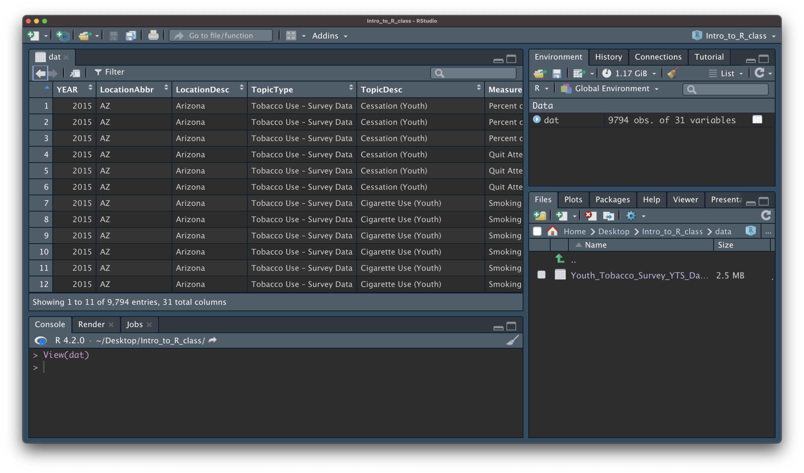

```{r, echo = FALSE}
library(knitr)
library(readr)
opts_chunk$set(comment = "")
```

<style type="text/css">
pre { /* Code block - slightly smaller in this lecture */
    font-size: 20px;
}
</style>

## Day 1 Review

-  the RStudio Editor (top) is for static code like scripts or R Markdown documents
-  The console is for testing code (bottom) - best to save your code though!
-  R code goes within what is called a chunk (the gray box with a green play button)
-  **Objects** (like nouns) are data or variables.

## Day 1 Review

- R functions as a calculator
- Use `<-` to save (assign) values to objects
- **Functions** (like verbs) perform specific tasks in R and are found within packages
- Use `c()` to **combine** vectors
- `length()`, `class()`, and `str()` tell you information about an object
- Install packages with `install.packages()`
- Load packages with `library()`
- Get help with `?` or help pane

## Day 1 Review

- Make sure we have installed and loaded the `tidyverse` package!

## Outline 

* Part 0: A little bit of set up!
* Part 1: reading in manually (point and click) (.csv)
* Part 2: checking data & multiple file formats (.xlsx)


# Part 0: Setup - R Project


## New R Project

Let's make an R Project so we can stay organized in the next steps.

Click the new R Project button at the top left of RStudio:

```{r, fig.alt="The New R Project button is highlighted.", out.width = "40%", echo = FALSE, align = "center"}

```


## New R Project

In the New Project Wizard, click "New Directory":

```{r, fig.alt="In the New Project Wizard, the 'New Directory' option is highlighted.", out.width = "60%", echo = FALSE, align = "center"}

```


## New R Project

Click "New Project":

```{r, fig.alt="In the New Project Wizard, the 'New Project' option is highlighted.", out.width = "60%", echo = FALSE, align = "center"}

```


## New R Project

Type in a name for your new folder.

Store it somewhere easy to find, such as your Desktop:

```{r, fig.alt="In the New Project Wizard, the new project has been given a name and is going to be stored in the Desktop directory. The 'Create Project' button is highlighted.", out.width = "60%", echo = FALSE, align = "center"}

```


## New R Project

You now have a new R Project folder on your Desktop! 

Make sure you add any scripts or data files to this folder as we go through today's lesson. This will make sure R is able to "find" your files.

```{r, fig.alt="The image shows an image of an arrow pointing to the newly created R project repository.", out.width = "60%", echo = FALSE, align = "center"}
knitr::include_graphics("images/Data_Input_new_desktop.png")
```

## New R Project

Pause here! Confirm the Project is set up.

# Part 1: Getting data into R (manual/point and click, .csv)

## Data Input

* 'Reading in' data is the first step of any real project/analysis
* R can read almost any file format, especially via add-on packages
* We are going to focus on simple delimited files first
    * comma separated (e.g. '.csv')


## Data Input

Youth Tobacco Survey (YTS) dataset:

"The YTS was developed to provide states with comprehensive data on both middle school and high school students regarding tobacco use, exposure to environmental tobacco smoke, smoking cessation, school curriculum, minors' ability to purchase or otherwise obtain tobacco products, knowledge and attitudes about tobacco, and familiarity with pro-tobacco and anti-tobacco media messages."

* Check out the data at: https://catalog.data.gov/dataset/youth-tobacco-survey-yts-data


## Data Input: Dataset Location

Dataset is located at http://hutchdatascience.org/intro_to_r/data/Youth_Tobacco_Survey_YTS_Data.csv

* Download data by clicking the above link
    
    * Safari - if a file loads in your browser, choose File --> Save As, select, Format "Page Source" and save


## Import Dataset

-  `>` File
-  `>` Import Dataset
-  `>` From Text (`readr`)
-  `>` paste the url (http://hutchdatascience.org/intro_to_r/data/Youth_Tobacco_Survey_YTS_Data.csv)
-  `>` click "Update" and "Import"


## Import Dataset

```{r, fig.alt="Gif showing the process of importing a dataset via readr.", out.width = "100%", echo = FALSE, align = "center"}
knitr::include_graphics("images/Data_Input_import_dataset.gif")
```


## What Just Happened?

You see a preview of the data on the top left pane.

```{r, fig.alt="The image shows an image of an arrow pointing to the newly created R project repository.", out.width = "80%", echo = FALSE, align = "center"}

```


## What Just Happened?

You see a new object called `Youth_Tobacco_Survey_YTS_Data` in your environment pane (top right). The table button opens the data for you to view.

```{r, fig.alt="The image shows an image of an arrow pointing to the newly created R project repository.", out.width = "80%", echo = FALSE, align = "center"}

```


## What Just Happened?

R ran some code in the console (bottom left).

```{r, fig.alt="The image shows an image of an arrow pointing to the newly created R project repository.", out.width = "80%", echo = FALSE, align = "center"}

```


## Browsing for Data on Your Machine

```{r, fig.alt="The image shows an image of an arrow pointing to the newly created R project repository.", out.width = "80%", echo = FALSE, align = "center"}
knitr::include_graphics("images/Data_Input_browse.png")
```


## Summary

Review the process: [`https://youtu.be/LEkNfJgpunQ`](https://youtu.be/LEkNfJgpunQ)

-  `>` File
-  `>` Import Dataset
-  `>` From Text (`readr`)
-  `>` paste the url (http://hutchdatascience.org/intro_to_r/data/Youth_Tobacco_Survey_YTS_Data.csv)
-  `>` click "Update" and "Import"


# Let's practice!

## Importing "states" data

- Try downloading the dataset located here: https://hutchdatascience.org/SeattleStatSummer_R/data/states.csv
- Use the File > Import Dataset > from Text (`readr`)
- Browse for the downloaded file on your machine
- Inspect the code that was run. Copy this code into your R Markdown document for later!


## Looking at the code

```{r eval=FALSE}
library(readr)
states <- read_csv("~/Downloads/states.csv")
View(states)
```

Notice that the part in quotes is a location on my computer. If I move the file, I won't be able to use the same code again. Better to move that file to my project folder (instead of my downloads for example) for longer-term storage.

```{r echo=FALSE, message=FALSE}
library(readr)
states <- read_csv("https://hutchdatascience.org/SeattleStatSummer_R/data/states.csv")
```

# Part 2: Checking data & Other formats

## Data Input: Checking the data

- the `View()` function shows your data in a new tab, in spreadsheet format
- be careful if your data is big!

```{r eval = FALSE}
View(states)
```

```{r, fig.alt="Screenshot of the RStudio console. 'View(dat)' has been typed and the data appears in table format.", out.width = "80%", echo = FALSE, align = "center"}

```


## Data Input: Checking the data

The `str()` function can tell you about data/objects(different variables and their classes - more on this later). 

```{r}
str(states)
```


## Data Input: Excel files

- Getting data from Excel is a bit more complicated. You have to download the file, either through R or manually.
- R does not know how to read excel files by default. We will use a package called `readxl` to do that.


## Let's bring the following into R:

https://hutchdatascience.org/SeattleStatSummer_R/data/asthma.xlsx

-  `>` File
-  `>` Import Dataset
-  `>` From Excel ...
-  `>` paste the url (https://hutchdatascience.org/SeattleStatSummer_R/data/asthma.xlsx)
-  `>` click "Update" and "Import"


## Looking at the code:

```{r eval=FALSE}
library(readxl)
url <- "https://hutchdatascience.org/SeattleStatSummer_R/data/asthma.xlsx"
destfile <- "asthma.xlsx"
curl::curl_download(url, destfile)
asthma <- read_excel(destfile)
View(asthma)
```


# Let's practice!

## Importing tuberculosis data

- Try downloading the dataset located here: https://hutchdatascience.org/SeattleStatSummer_R/data/tb_incidence.xlsx
- Use the File > Import Dataset > from Excel
- Browse for the downloaded file on your machine
- Inspect the code that was run. Copy this code into your R Markdown document for later!


## Looking at the code

```{r eval=FALSE}
library(readxl)
tb_incidence <- read_excel("tb_incidence.xlsx")
View(tb_incidence)
```


## Modifying the code

You can name the dataset whatever you want, it's an object in your Environment now.

```{r eval=FALSE}
library(readxl)
my_data <- read_excel("tb_incidence.xlsx")
View(my_data)
```


## Summary

-  `>` File
-  `>` Import Dataset
-  `>` From Text (`readr`) **OR** From Excel
-  `>` paste the url or Browse for the file
-  `>` click "Update" and "Import"
-  `>` save the code for later!

🏠 [Workshop Website](https://hutchdatascience.org/SeattleStatSummer_R/)
