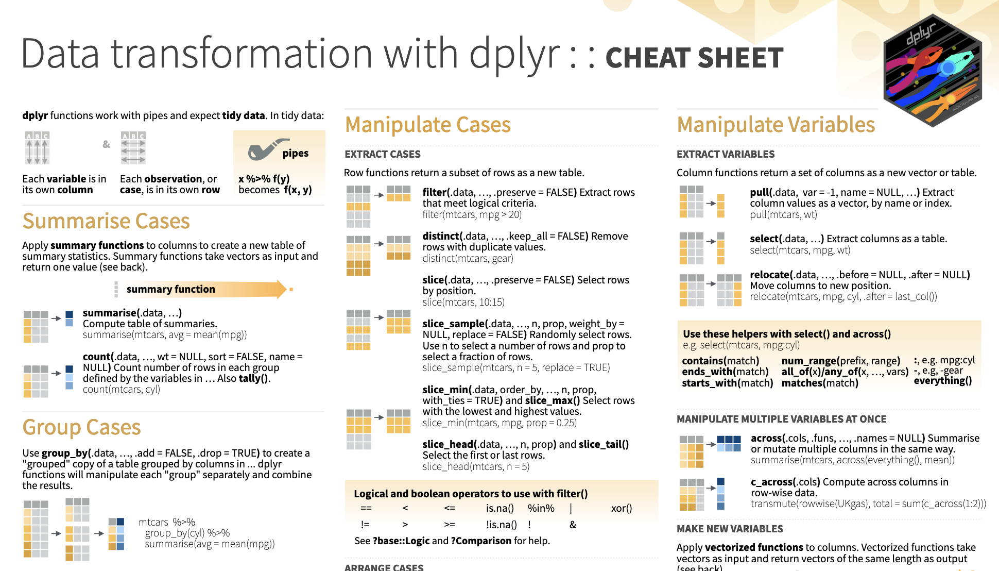

```{r, echo = FALSE, message=FALSE, error = FALSE}
library(knitr)
opts_chunk$set(comment = "", message = FALSE)
suppressWarnings({library(dplyr)})
library(readr)
library(tidyverse)
library(jhur)
```

<style type="text/css">
pre { /* Code block - slightly smaller in this lecture */
    font-size: 20px;
}
</style>


## Another Cheatsheet

https://raw.githubusercontent.com/rstudio/cheatsheets/main/data-transformation.pdf

```{r, fig.alt="A preview of the Data transformation cheatsheet produced by RStudio.", out.width = "80%", echo = FALSE, align = "center"}

```

# Part 1: Numeric / continous data

## Data Summarization

* Basic statistical summarization
    * `mean(x)`: takes the mean of x
    * `sd(x)`: takes the standard deviation of x
    * `median(x)`: takes the median of x
    * `quantile(x)`: displays sample quantiles of x. Default is min, IQR, max
    * `range(x)`: displays the range. Same as `c(min(x), max(x))`
    * `sum(x)`: sum of x
    * `max(x)`: maximum value in x
    * `min(x)`: minimum value in x
    
* **all have the ** `na.rm =` **argument for missing data**


## Statistical summarization

The vector getting summarized goes inside the parentheses:

```{r}
x <- c(1, 5, 7, 4, 2, 8)
mean(x)
range(x)
sum(x)
```


## Statistical summarization

Note that many of these functions have additional inputs regarding missing data, typically requiring the `na.rm` argument ("remove NAs"). 

```{r error = TRUE}
x <- c(1, 5, 7, 4, 2, 8, NA)
mean(x)
mean(x, na.rm = TRUE)
quantile(x)
quantile(x, na.rm = TRUE)
```


## Statistical summarization{.codesmall}

You can only do summarization on numeric or logical types. Not characters.

```{r error = TRUE}
x <- c(1, 5, 7, 4, 2, 8)
sum(x)
y <- c(TRUE, FALSE, FALSE, TRUE) # FALSE == 0 and TRUE == 1
sum(y)
z <- c("TRUE", "FALSE", "FALSE", "TRUE")
sum(z)
```


## But how do we do this on dataframes?

First we will need to learn about something called the "pipe".

The pipe is this operator in R: `%>%`. It tells R to "pipe" the dataset on the left into the next function.


## Using the pipe `%>%`

```{r}
states <- read_csv("https://hutchdatascience.org/SeattleStatSummer_R/data/states.csv")
states %>% head() # Same as head(states)!
```


## States data

`colnames()` will show us the column names.

```{r}
colnames(states)
```

# Summarizing the data

## Summarize the data: `dplyr` `summarize()` function

`summarize` creates a summary table of a column you're interested in.

<div class = "codeexample">
```{r, eval = FALSE}
# General format - Not the code!
{data to use} %>% 
   summarize({summary column name} = {operator(source column)}) 
```
</div>


## Summarize the data: `dplyr` `summarize()` function

`summarize` creates a summary table of a column you're interested in.

<div class = "codeexample">
```{r, eval = FALSE}
# General format - Not the code!
{data to use} %>% 
   summarize({summary column name} = {operator(source column)}) 
```
</div>

```{r}
states %>% 
  summarize(mean_population = mean(population))
```


## What if there are NAs in my data?

```{r}
states %>% 
  summarize(mean_population = mean(cesarean_percent))
states %>% 
  summarize(mean_population = mean(cesarean_percent, na.rm = TRUE))
```

add `na.rm = TRUE`.


## Summarize the data: `dplyr` `summarize()` function

`summarize()` can do multiple operations at once. Separate by a comma. Breaking line between these keeps things tidy!

```{r}
states %>% 
  summarize(mean_population = mean(population),
            median_population = median(population))
```


## `summary()` Function

Using `summary()` can give you rough snapshots of each numeric column (character columns are skipped):

```{r}
summary(states)
```


# Let's practice!

## Practice

Modify the code below from the `states` dataset to `summarize()` the `fertility_rate_per_1000` column. Find the mean, min, and max.

```{r eval=FALSE}
states %>% 
  summarize(??? = mean(???),
            ??? = min(???),
            ??? = max(???))
```


## Practice

Modify the code below from the `states` dataset to `summarize()` the `fertility_rate_per_1000` column. Find the mean, min, and max.

```{r}
states %>% 
  summarize(mean_fert = mean(fertility_rate_per_1000),
            min_fert = min(fertility_rate_per_1000),
            max_fert = max(fertility_rate_per_1000))
```


## Summary Part 1

- don't forget the `na.rm = TRUE` argument!
- `summary(x)`: quantile information
- `summarize`: creates a summary table of columns of interest

# Part 2: Categorical data

## `dplyr`: `count` 

Use `count` to return a frequency table of unique elements of a data.frame.

```{r, message = FALSE}
yts %>% count(LocationDesc)
```


## `dplyr`: `count` 

Multiple columns listed further subdivides the count.

```{r, message = FALSE}
yts %>% count(LocationDesc, TopicDesc)
```


## `dplyr`: `count` 

Multiple columns listed further subdivides the count.

```{r, message = FALSE}
yts %>% count(LocationDesc, TopicDesc)
```

<br>

**Note:** `count()` includes NAs


# Grouping

## Perform Operations By Groups: dplyr

`group_by` allows you group the data set by variables/columns you specify:

```{r}
# Regular data
yts
```


## Perform Operations By Groups: dplyr

`group_by` allows you group the data set by variables/columns you specify:

```{r}
yts_grouped <- yts %>% group_by(Response)
yts_grouped
```


## Summarize the grouped data

It's grouped! Grouping doesn't change the data in any way, but how **functions operate on it**. Now we can summarize `Data_Value` (percent of respondents) by group:

```{r}
yts_grouped %>% summarize(avg_percent = mean(Data_Value, na.rm = TRUE))
```


## Use the `pipe` to string these together!

Pipe `yts` into `group_by`, then pipe that into `summarize`:

```{r}
yts %>%
  group_by(Response) %>%
  summarize(avg_percent = mean(Data_Value, na.rm = TRUE),
            max_percent = max(Data_Value, na.rm = TRUE))
```


## Group by as many variables as you want

`group_by` Response and Education:

```{r}
yts %>%
  group_by(Response, Education) %>%
  summarize(avg_percent = mean(Data_Value, na.rm = TRUE),
            max_percent = max(Data_Value, na.rm = TRUE))
```


## Ungroup the data

The `ungroup` function will allow you to clear the groups from the data. You can also overwrite the first `group_by` with a new one.

```{r}
yts <- ungroup(yts)
yts
```


## `group_by` with `mutate` - just add data

We can also use `mutate` to calculate the mean value for each year and add it as a column:

```{r}
yts %>%
  group_by(YEAR) %>%
  mutate(year_avg = mean(Data_Value, na.rm = TRUE)) %>%
  select(LocationDesc, Data_Value, year_avg)
```


## Counting

There are other functions, such as `n()` count the number of observations (NAs included).

```{r}
yts %>%
  group_by(YEAR) %>%
  summarize(n = n(),
            mean = mean(Data_Value, na.rm = TRUE))
```


## Counting{.codesmall}

`count()` and `n()` can give very similar information.

```{r}
mtcars %>% count(cyl)
mtcars %>% group_by(cyl) %>% summarize(n()) # n() typically used with summarize
```


## Summary & Lab Part 2

- `count(x)`: what unique values do you have? 
  - `pull()` gives a vector
  - `unique()` combined with `length()`
- `group_by()`: changes all subsequent functions
  - combine with `summarize()` to get statistics per group
  - combine with `mutate()` to add column
- `summarize()` with `n()` gives the count (NAs included) 

🏠 [Class Website](https://jhudatascience.org/intro_to_r/)

💻 [Lab](https://jhudatascience.org/intro_to_r/modules/Data_Summarization/lab/Data_Summarization_Lab.Rmd)


# Preview: plotting

## Basic Plots

Plotting is an important component of exploratory data analysis. These are some rough plots that you can use in real time while exploring your data. 

**We will go over formatting and making plots look nicer in additional lectures.**

* Basic summarization plots: 
    * `hist(x)`: histogram of x
    * `plot(x,y)`: scatterplot of x and y
    * `boxplot(y~x)`: boxplot of y against levels of x


## Histogram

```{r}
mpg <- jhu_cars %>% pull(mpg)
hist(x = mpg)
```


## Histogram

Use the `breaks =` argument to tweak the resolution:

```{r}
hist(x = mpg, breaks = 10)
```


## Scatterplot

```{r}
mpg <- jhu_cars %>% pull(mpg)
hp <- jhu_cars %>% pull(hp)
plot(x = hp, y = mpg) # plot(hp, mpg)
```


## Boxplot

```{r}
cyl <- jhu_cars %>% pull(cyl)
hp <- jhu_cars %>% pull(hp)
boxplot(formula = hp ~ cyl)
```


## Summary & Lab Part 3

- `plot(x,y)` and `hist(x)` are great for a **quick snapshot** of the data
- `boxplot(y ~ x)` works for categorical data

🏠 [Class Website](https://jhudatascience.org/intro_to_r/)

💻 [Lab](https://jhudatascience.org/intro_to_r/modules/Data_Summarization/lab/Data_Summarization_Lab.Rmd)

```{r, fig.alt="The End", out.width = "50%", echo = FALSE, fig.align='center'}
knitr::include_graphics(here::here("images/the-end-g23b994289_1280.jpg"))
```

Image by <a href="https://pixabay.com/users/geralt-9301/?utm_source=link-attribution&amp;utm_medium=referral&amp;utm_campaign=image&amp;utm_content=812226">Gerd Altmann</a> from <a href="https://pixabay.com//?utm_source=link-attribution&amp;utm_medium=referral&amp;utm_campaign=image&amp;utm_content=812226">Pixabay</a>

