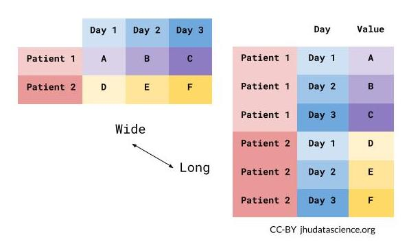

```{r, echo = FALSE, include=FALSE}
library(knitr)
library(readr)
opts_chunk$set(comment = "")
library(tidyverse)
```

## Recap of Subsetting

- `pull()` to get values out of a data frame
- `select()` creates a smaller data frame with only certain columns
-  you can `select()` based on patterns in the column names using tidyselect functions
-  you can combine multiple tidyselect functions together like `select(starts_with("C"), ends_with("state"))`
- `filter()` can be used to filter out rows based on logical conditions
-  avoid using quotes when referring to column names with `filter()`

## Recap Subsetting Continued

- `==` is the same as equivalent to
- `&` means both conditions must be met to remain after `filter()`
- `|` means either conditions needs to be met to remain after `filter()`


## Recap of Data Cleaning

-   `count()` can help determine if we have `NA` values
-   `filter()` automatically removes `NA` values - can't confirm or deny
    if condition is met (need `| is.na()` to keep them)
-   `drop_na()` can help you remove `NA` values from a variable or an
    entire data frame
-   `NA` values can change your calculation results
-   think about what `NA` values represent

## Recap of Data Cleaning

-   `recode()` can help with simple recoding values of a variable (needs to be inside the `mutate` function)

📃[Cheatsheet](https://hutchdatascience.org/SeattleStatSummer_R/modules/cheatsheets/Day-3.pdf)

## Manipulating Data 

In this module, we will show you how to:

1. The two major forms of data (long and wide)
2. Reshape data from wide to long for data analysis and visualization


## What is wide/long data?

<div style="font-size:40pt">
Data is wide or long **with respect** to certain variables.
</div>

```{r, fig.alt="Wide versus long data rearanges the position of column names and row content.", out.width = "60%", echo = FALSE, fig.align='center'}

```

## What is wide/long data?

Data is stored *differently* in the tibble.

```{r, echo = FALSE}
ex_wide <- tibble(State = "Alabama",
                 June_vacc_rate = 0.516,
                 May_vacc_rate = 0.514,
                 April_vacc_rate = 0.511
                     )
ex_long <- pivot_longer(ex_wide, cols = !State)
```

Wide: has many columns

```{r, echo = FALSE}
ex_wide
```

Long: column names become data

```{r, echo = FALSE}
ex_long
```

## What is wide/long data?

```{r, echo = FALSE}
ex_wide <- tibble(State = c("Alabama", "Alaska"),
                 June_vacc_rate = c(0.516, 0.627),
                 May_vacc_rate = c(0.514, 0.626),
                 April_vacc_rate = c(0.511, 0.623)
                     )
ex_long <- pivot_longer(ex_wide, cols = !State)
```

Wide: multiple columns per individual, values spread across multiple columns 

```{r, echo = FALSE}
ex_wide
```

Long: multiple rows per observation, a single column contains the values

```{r, echo = FALSE}
ex_long
```

## What is wide/long data?

https://github.com/gadenbuie/tidyexplain/blob/main/images/tidyr-pivoting.gif

```{r, fig.alt="A gif visualization of data going from wide to long form.", out.width = "40%", echo = FALSE, align = "center"}
knitr::include_graphics("images/tidyr_pivoting.gif")
```

## Why do we need to switch between wide/long data?

Wide: **Easier for humans to read**

```{r, echo = FALSE}
ex_wide
```

Long: **Easier for R to make plots & do analysis**

```{r, echo = FALSE}
ex_long
```

## Pivoting using `tidyr` package

`tidyr` allows you to "tidy" your data.  We will be talking about:

- `pivot_longer` - make multiple columns into variables, (wide to long)


# `pivot_longer`...

## Reshaping data from **wide to long** {.codesmall} 

`pivot_longer()` - puts column data into rows (`tidyr` package)

- First describe which columns we want to "pivot_longer"

<div class = "codeexample">
```{r, eval=FALSE}
{long_data} <- {wide_data} %>% pivot_longer(cols = {columns to pivot})
```
</div>

## Reshaping data from **wide to long**

```{r, echo = FALSE}
wide_data <- tibble(
  June_vacc_rate = 0.516,
  May_vacc_rate = 0.514,
  April_vacc_rate = 0.511
)

long_data <- wide_data %>% pivot_longer(cols = everything())

```

```{r}
wide_data
long_data
```

## Reshaping data from **wide to long** {.codesmall} 

`pivot_longer()` - puts column data into rows (`tidyr` package)

- First describe which columns we want to "pivot_longer"
- `names_to =` gives a new name to the pivoted columns
- `values_to =` gives a new name to the values that used to be in those columns

<div class = "codeexample">
```{r, eval=FALSE}
{long_data} <- {wide_data} %>% pivot_longer(cols = {columns to pivot},
                                        names_to = {New column name: contains old column names},
                                        values_to = {New column name: contains cell values})
```
</div>

## Reshaping data from **wide to long**

```{r, echo = FALSE}
wide_data <- tibble(
  June_vacc_rate = 0.516,
  May_vacc_rate = 0.514,
  April_vacc_rate = 0.511
)
```

```{r}
wide_data
long_data <- wide_data %>% pivot_longer(cols = everything(),
                                        names_to = "Month",
                                        values_to = "Rate")
long_data
```

Newly created column names are enclosed in quotation marks.

## Data used: Charm City Circulator

https://hutchdatascience.org/SeattleStatSummer_R/data/Charm_City_Circulator_Ridership.csv

```{r, message = FALSE}
circ <- read_csv("https://hutchdatascience.org/SeattleStatSummer_R/data/Charm_City_Circulator_Ridership.csv")
head(circ, 5)
```

## Mission: Taking the averages by line

Let's imagine we want to create a table of average ridership by route/line. Results should look something like:

```{r, message = FALSE}
example <- tibble(line = c("orange","purple","green","banner"),
                  avg = c("600(?)", "700(?)", "500(?)", "400(?)")
)
example
```

## Reshaping data from **wide to long**

```{r}
long <- circ %>% 
  pivot_longer(
            cols = starts_with(c("orange","purple","green","banner")), 
        names_to = "bus_type",
        values_to = "number_of_individuals")
long
```


# `pivot_wider`...

## Reshaping data from **long to wide**

`pivot_wider()` - spreads row data into columns (`tidyr` package)

- `names_from =` the old column whose contents will be spread into multiple new column names.
- `values_from =` the old column whose contents will fill in the values of those new columns.

<div class = "codeexample">
```{r, eval=FALSE}
{wide_data} <- {long_data} %>% 
  pivot_wider(names_from = {Old column name: contains new column names},
              values_from = {Old column name: contains new cell values})
```
</div>

## Reshaping data from **long to wide**

```{r}
long_data
wide_data <- long_data %>% pivot_wider(names_from = "Month", 
                                       values_from = "Rate") 
wide_data
```

## Reshaping Charm City Circulator

```{r}
long
```

## Reshaping Charm City Circulator

```{r}
wide <- long %>% pivot_wider(names_from = "bus_type", 
                             values_from = "number_of_individuals") 
wide
```

## Summary

- `pivot_longer()` goes from wide -> long
     - Specify columns you want to pivot
     - Specify `names_to = ` and `values_to = ` for custom naming
- `pivot_wider()` goes from long -> wide
     - Specify `names_from =` and `values_from = `

🏠 [Workshop Website](https://hutchdatascience.org/SeattleStatSummer_R/)


